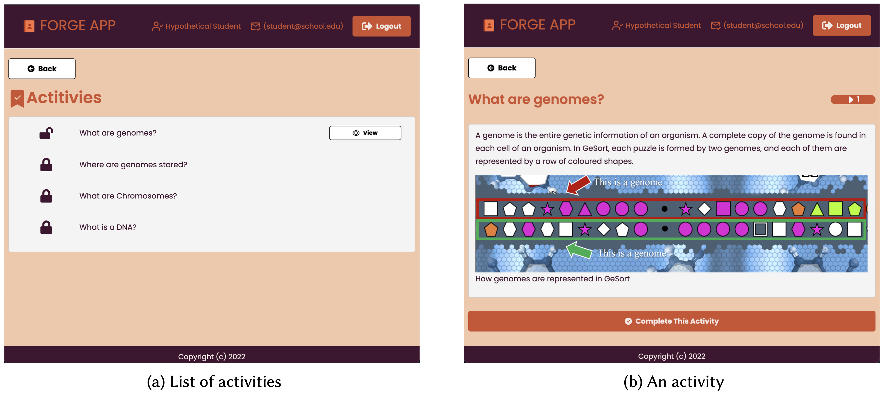

# FORGE App
This website is an educational application designed for the classroom. In it, the student finds a list of activities (Figure 1-a) released sequentially after interacting with each of them (Figure 1-b). It was created to show a possible use of the FORGE framework.

FORGE is a framework created to manage rewards in gamified environments. Registering the rewards and defining how they will be released is possible. The framework has an API that receives messages, processes them, and sends rewards back. More about the [FORGE framework can be learned from its repository](https://github.com/Vinashu/forge-server).

In the case of the FORGE App, each activity is a reward created in the FORGE framework. In addition to basic functionality, such as user control and content display, the site prepares messages, sends them to the framework, and applies changes that reflect the responses received.

 

## Live Demo
It is possible to test the FORGE App directly online. It is hosted on a free service that goes offline after 10 minutes of inactivity. The server works again as soon as a request is made to it.

The Forge App: [https://forge-app-example.herokuapp.com/](https://forge-app-example.herokuapp.com/)

There is also an online version of the FORGE framework available for testing. All rewards created in it will be visible in the FORGE App.

The FORGE Framework: [https://forge-server-example.herokuapp.com/](https://forge-server-example.herokuapp.com/)